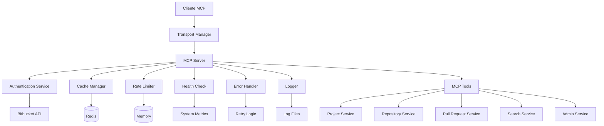
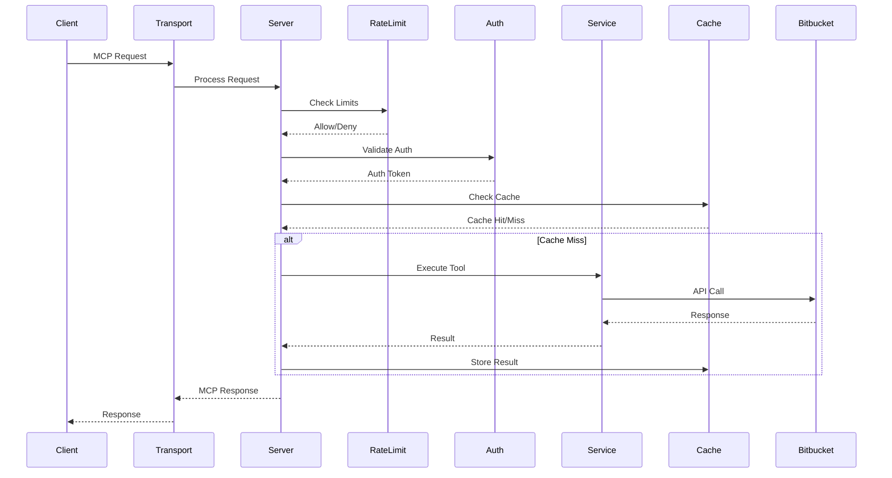
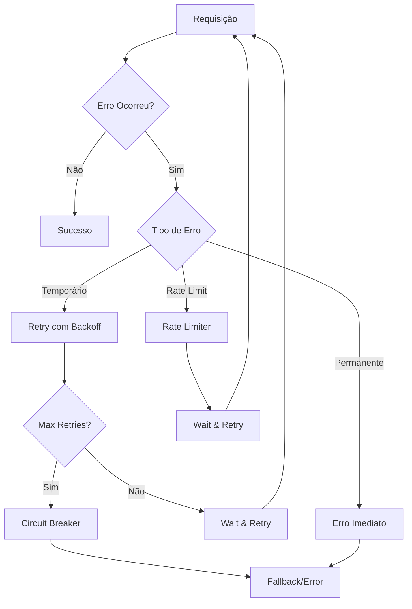
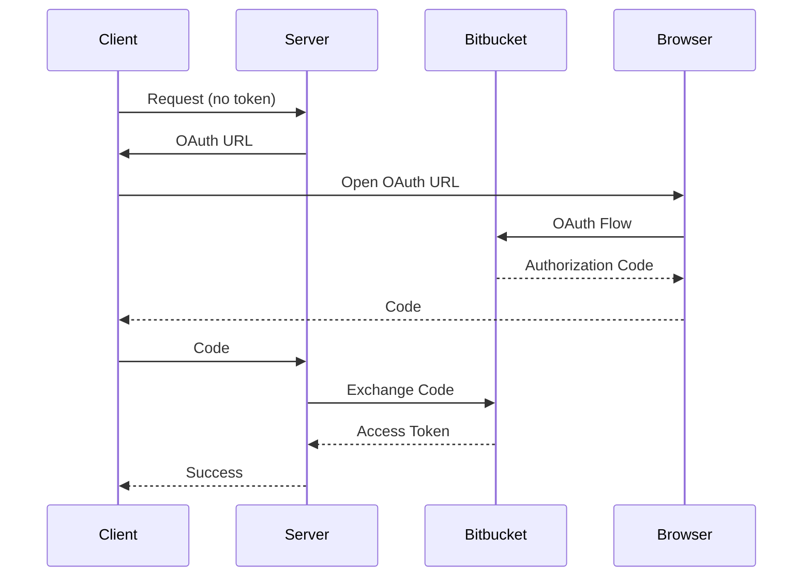
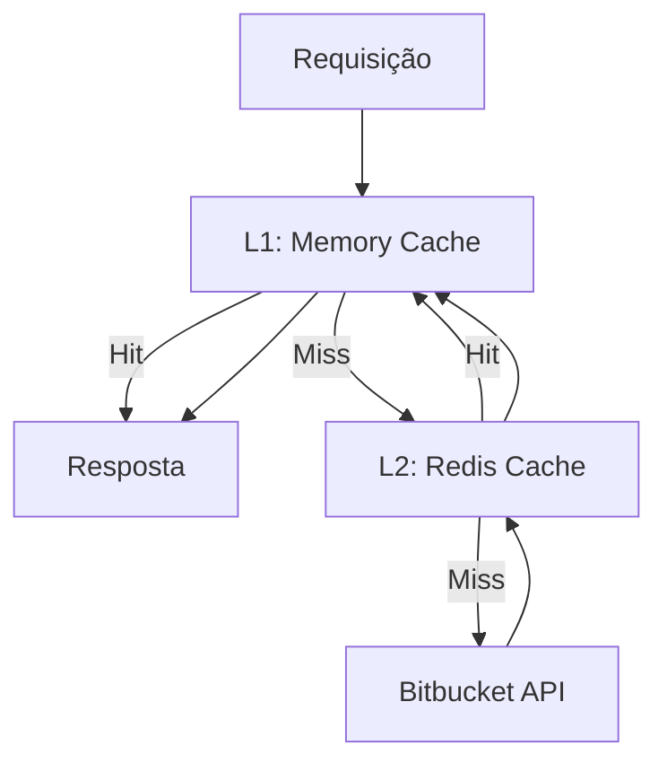
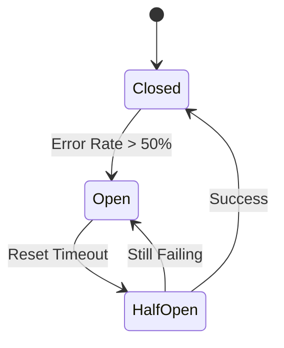

# 🏗️ Arquitetura do Sistema

## Visão Geral

O Bitbucket MCP Server é um servidor Model Context Protocol (MCP) que fornece integração completa com instâncias do Bitbucket Data Center e Cloud. O sistema foi projetado com foco em robustez, escalabilidade e facilidade de uso.

## 🎯 Princípios Arquiteturais

### 1. **Modularidade**
- Separação clara de responsabilidades
- Serviços independentes e testáveis
- Interfaces bem definidas

### 2. **Resiliência**
- Circuit breakers para proteção contra falhas
- Rate limiting para controle de carga
- Retry automático com backoff exponencial
- Health checks contínuos

### 3. **Observabilidade**
- Logs estruturados com sanitização
- Métricas de performance
- Monitoramento de saúde do sistema
- Rastreamento de requisições

### 4. **Flexibilidade**
- Suporte a múltiplos transportes
- Configuração via variáveis de ambiente
- Cache configurável (memória/Redis)
- Detecção automática de servidor

## 🏛️ Arquitetura de Alto Nível



## 🔧 Componentes Principais

### 1. **MCP Server Core** (`src/server/`)
- **`index.ts`**: Servidor principal MCP
- **`transports/`**: Gerenciamento de transportes
- **`tools/`**: Implementação das ferramentas MCP

### 2. **Serviços de Infraestrutura** (`src/services/`)
- **`authentication.ts`**: Autenticação OAuth 2.0, PAT, App Passwords
- **`cache.ts`**: Gerenciamento de cache (memória/Redis)
- **`rate-limiter.ts`**: Rate limiting e circuit breakers
- **`health-check.ts`**: Monitoramento de saúde
- **`error-handling.ts`**: Tratamento de erros e retry
- **`server-detection.ts`**: Detecção de tipo de servidor

### 3. **Serviços de Negócio** (`src/services/`)
- **`ProjectService.ts`**: Gestão de projetos
- **`RepositoryService.ts`**: Gestão de repositórios
- **`PullRequestService.ts`**: Gestão de pull requests
- **`SearchService.ts`**: Busca e pesquisa
- **`AdminService.ts`**: Operações administrativas

### 4. **Configuração** (`src/config/`)
- **`environment.ts`**: Validação de variáveis de ambiente
- **`auth.ts`**: Configurações de autenticação

### 5. **Utilitários** (`src/utils/`)
- **`logger.ts`**: Sistema de logging estruturado
- **`validation.ts`**: Validação de dados

## 🚀 Fluxo de Requisições

### 1. **Recepção da Requisição**


### 2. **Tratamento de Erros**


## 🔐 Sistema de Autenticação

### Hierarquia de Autenticação
1. **OAuth 2.0** (Prioridade 1)
2. **Personal Access Token** (Prioridade 2)
3. **App Password** (Prioridade 3)
4. **Basic Auth** (Prioridade 4)

### Fluxo OAuth 2.0


## 💾 Sistema de Cache

### Estratégia de Cache
- **TTL**: 5 minutos por padrão
- **Eviction**: LRU (Least Recently Used)
- **Partitioning**: Por contexto (projeto, repositório, etc.)
- **Invalidation**: Por padrões e eventos

### Hierarquia de Cache


## 🛡️ Rate Limiting e Circuit Breakers

### Rate Limiting
- **Global**: 100 req/15min
- **Por IP**: 50 req/15min
- **Por Usuário**: 100 req/15min
- **API Pesada**: 25 req/15min

### Circuit Breakers


## 📊 Monitoramento e Observabilidade

### Health Checks
- **Sistema**: CPU, memória, disco
- **Rede**: Conectividade com Bitbucket
- **Cache**: Hit rate, tamanho
- **Rate Limiter**: Status dos limiters
- **Circuit Breakers**: Estado dos breakers

### Logs Estruturados
```json
{
  "timestamp": "2024-01-27T10:30:00.123Z",
  "level": "info",
  "message": "Request processed",
  "type": "request",
  "method": "GET",
  "url": "/api/repositories",
  "statusCode": 200,
  "responseTime": 150,
  "requestId": "req_1706355000123_abc123def",
  "userId": "user123",
  "projectKey": "PROJ",
  "sanitized": true
}
```

## 🔄 Transportes Suportados

### 1. **STDIO** (Padrão)
- Comunicação via stdin/stdout
- Ideal para integração com IDEs
- Baixa latência

### 2. **HTTP**
- API REST tradicional
- Suporte a CORS
- Ideal para integração web

### 3. **Server-Sent Events (SSE)**
- Streaming de dados em tempo real
- Ideal para notificações
- Reconexão automática

### 4. **Streaming**
- Comunicação bidirecional
- Ideal para operações longas
- Suporte a cancelamento

## 🧪 Estratégia de Testes

### 1. **Testes Unitários** (`tests/unit/`)
- Cobertura > 80%
- Testes de serviços individuais
- Mocks para dependências externas

### 2. **Testes de Integração** (`tests/integration/`)
- Testes de fluxos completos
- Integração com APIs reais
- Testes de performance

### 3. **Testes de Contrato** (`tests/contract/`)
- Validação de interfaces MCP
- Compatibilidade de versões
- Testes de regressão

## 📈 Escalabilidade

### Horizontal
- Múltiplas instâncias do servidor
- Load balancer para distribuição
- Cache Redis compartilhado

### Vertical
- Otimização de memória
- Pool de conexões
- Compressão de dados

## 🔒 Segurança

### 1. **Autenticação**
- OAuth 2.0 com PKCE
- Tokens com expiração
- Refresh automático

### 2. **Autorização**
- Validação de permissões
- Escopo de acesso
- Auditoria de ações

### 3. **Sanitização**
- Logs sem dados sensíveis
- Validação de entrada
- Escape de caracteres

### 4. **Rate Limiting**
- Proteção contra abuso
- Diferentes limites por tipo
- Blacklist de IPs

## 🚀 Deploy e Operação

### 1. **Containerização**
- Docker multi-stage build
- Imagem otimizada
- Health checks

### 2. **Configuração**
- Variáveis de ambiente
- Configuração por ambiente
- Validação de configuração

### 3. **Monitoramento**
- Métricas de Prometheus
- Logs centralizados
- Alertas automáticos

### 4. **Backup e Recovery**
- Backup de configuração
- Restore automático
- Disaster recovery

## 🔮 Roadmap Técnico

### Fase 1: Estabilização ✅
- [x] Core MCP Server
- [x] Autenticação básica
- [x] Cache simples
- [x] Logs básicos

### Fase 2: Robustez ✅
- [x] Rate limiting
- [x] Circuit breakers
- [x] Health checks
- [x] Error handling

### Fase 3: Observabilidade ✅
- [x] Logs estruturados
- [x] Métricas detalhadas
- [x] Monitoramento
- [x] Sanitização

### Fase 4: Escalabilidade (Futuro)
- [ ] Clustering
- [ ] Load balancing
- [ ] Sharding
- [ ] Caching distribuído

### Fase 5: Avançado (Futuro)
- [ ] Machine Learning
- [ ] Análise preditiva
- [ ] Otimização automática
- [ ] IA para debugging

## 📚 Referências

- [Model Context Protocol](https://modelcontextprotocol.io/)
- [Bitbucket REST API](https://developer.atlassian.com/bitbucket/api/2/reference/)
- [OAuth 2.0 RFC](https://tools.ietf.org/html/rfc6749)
- [Circuit Breaker Pattern](https://martinfowler.com/bliki/CircuitBreaker.html)
- [Rate Limiting Strategies](https://cloud.google.com/architecture/rate-limiting-strategies-techniques)
