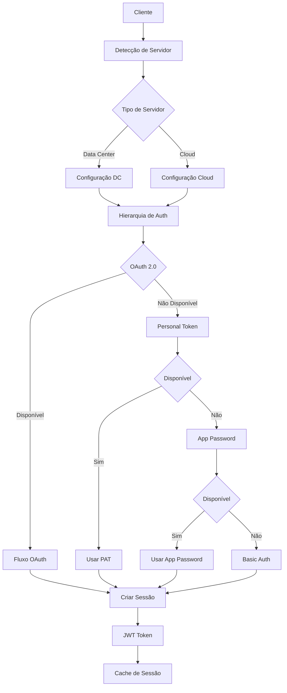

# Visão Geral do Sistema de Autenticação

## Introdução

O sistema de autenticação do Bitbucket MCP Server implementa uma hierarquia robusta de métodos de autenticação com suporte completo para Bitbucket Data Center e Cloud. O sistema segue rigorosamente a Constituição do projeto e implementa TDD obrigatório.

## Características Principais

### 🔐 Hierarquia de Autenticação
O sistema implementa uma hierarquia de prioridades para métodos de autenticação:

1. **OAuth 2.0** (Prioridade Máxima)
   - Mais seguro e moderno
   - Suporte a PKCE (Proof Key for Code Exchange)
   - Tokens de acesso e refresh
   - Revogação de tokens

2. **Personal Access Token**
   - Ideal para automação
   - Tokens de longa duração
   - Controle granular de permissões

3. **App Password**
   - Suporte legado
   - Compatibilidade com sistemas antigos
   - Senhas específicas por aplicação

4. **Basic Authentication** (Fallback)
   - Último recurso
   - Compatibilidade máxima
   - Usuário e senha tradicionais

### 🎯 Detecção Automática de Servidor
O sistema detecta automaticamente o tipo de servidor Bitbucket:

- **Data Center**: Detectado via `/rest/api/1.0/application-properties`
- **Cloud**: Detectado via API 2.0
- **Fallback**: Data Center 7.16 se detecção falhar
- **Cache**: 5 minutos para configurações, 30 segundos para health checks

### 🔄 Gerenciamento de Sessões
- **JWT Tokens**: Tokens seguros com expiração configurável
- **Cache de Sessões**: Armazenamento em memória com limpeza automática
- **Renovação Automática**: Refresh de tokens antes da expiração
- **Múltiplas Sessões**: Suporte a sessões simultâneas por usuário

## Arquitetura

### Componentes Principais

```
src/
├── services/auth/           # Serviços de autenticação
│   ├── authentication.ts    # Hierarquia de autenticação
│   ├── oauth.ts            # OAuth 2.0 implementation
│   ├── session.ts          # Gerenciamento de sessões
│   └── server-detection.ts # Detecção de servidor
├── tools/
│   ├── shared/auth/        # Ferramentas MCP compartilhadas
│   ├── datacenter/auth/    # Ferramentas MCP Data Center
│   └── cloud/auth/         # Ferramentas MCP Cloud
├── types/auth/             # Tipos TypeScript
└── config/auth.ts          # Configuração de autenticação
```

### Fluxo de Autenticação



## Ferramentas MCP

### Ferramentas Compartilhadas (13 total)

#### OAuth 2.0
- `mcp_bitbucket_auth_get_oauth_authorization_url` - Gerar URL de autorização
- `mcp_bitbucket_auth_get_oauth_token` - Trocar código por token
- `mcp_bitbucket_auth_refresh_oauth_token` - Renovar token
- `mcp_bitbucket_auth_revoke_access_token` - Revogar token

#### Gerenciamento de Sessão
- `mcp_bitbucket_auth_get_current_session` - Obter sessão atual
- `mcp_bitbucket_auth_create_session` - Criar nova sessão
- `mcp_bitbucket_auth_refresh_session` - Renovar sessão
- `mcp_bitbucket_auth_revoke_session` - Revogar sessão
- `mcp_bitbucket_auth_list_active_sessions` - Listar sessões ativas

#### Gerenciamento de Tokens
- `mcp_bitbucket_auth_get_access_token_info` - Informações do token
- `mcp_bitbucket_auth_revoke_access_token` - Revogar token

#### Aplicações OAuth (Data Center)
- `mcp_bitbucket_auth_create_oauth_application` - Criar aplicação OAuth
- `mcp_bitbucket_auth_get_oauth_application` - Obter aplicação OAuth
- `mcp_bitbucket_auth_update_oauth_application` - Atualizar aplicação OAuth
- `mcp_bitbucket_auth_delete_oauth_application` - Deletar aplicação OAuth
- `mcp_bitbucket_auth_list_oauth_applications` - Listar aplicações OAuth

## Segurança

### Medidas Implementadas
- **Criptografia**: AES-256-GCM para tokens sensíveis
- **PKCE**: Proteção contra ataques de interceptação
- **CSRF Protection**: State parameter para OAuth
- **Rate Limiting**: Proteção contra brute force
- **JWT Security**: Tokens assinados com algoritmos seguros
- **Sanitização**: Validação e limpeza de dados de entrada

### Configurações de Segurança
```typescript
{
  encryptionKey: "chave-de-32-caracteres-minimo",
  jwtSecret: "jwt-secret-de-32-caracteres-minimo",
  rateLimitWindow: 60000, // 1 minuto
  rateLimitMaxRequests: 100,
  maxLoginAttempts: 5,
  lockoutDuration: 300000, // 5 minutos
  tokenExpirationTime: 3600000, // 1 hora
  sessionTimeout: 1800000 // 30 minutos
}
```

## Configuração

### Variáveis de Ambiente
```bash
# OAuth Configuration
OAUTH_CLIENT_ID=your-client-id
OAUTH_CLIENT_SECRET=your-client-secret
OAUTH_REDIRECT_URI=http://localhost:3000/callback
OAUTH_SCOPE=read write

# Server Configuration
BITBUCKET_BASE_URL=https://your-bitbucket.com
BITBUCKET_SERVER_TYPE=datacenter
BITBUCKET_API_VERSION=1.0

# Security Configuration
JWT_SECRET=your-jwt-secret-32-chars-min
ENCRYPTION_KEY=your-encryption-key-32-chars-min

# Session Configuration
SESSION_TIMEOUT=3600000
SESSION_MAX_SESSIONS=100
```

### Configuração Programática
```typescript
import { authConfigurationManager } from '@/config/auth';

// Carregar configuração
const config = authConfigurationManager.loadConfiguration();

// Obter configuração otimizada para servidor
const optimizedConfig = authConfigurationManager.getOptimizedConfiguration('datacenter');

// Obter configuração recomendada
const recommended = authConfigurationManager.getRecommendedAuthConfiguration('cloud');
```

## Testes

### Cobertura de Testes
- **Cobertura Global**: >80%
- **Autenticação**: >85%
- **Tipos**: >90%

### Tipos de Testes
- **Testes de Contrato**: Validação de schemas e APIs
- **Testes Unitários**: Lógica de negócio isolada
- **Testes de Integração**: Fluxos completos com dependências reais

### Executar Testes
```bash
# Todos os testes
npm test

# Testes de autenticação
npm run test:unit -- tests/unit/auth
npm run test:integration -- tests/integration/auth
npm run test:contract -- tests/contract/auth

# Cobertura
npm run test:coverage
```

## Monitoramento

### Métricas de Autenticação
- Taxa de sucesso de autenticação
- Tempo de resposta de autenticação
- Número de tentativas de login
- Sessões ativas
- Tokens expirados

### Logs de Auditoria
- Tentativas de login (sucesso/falha)
- Criação/revogação de sessões
- Uso de tokens OAuth
- Detecção de servidor
- Erros de autenticação

## Troubleshooting

### Problemas Comuns
1. **Falha na detecção de servidor**
   - Verificar conectividade de rede
   - Validar URL do servidor
   - Verificar certificados SSL

2. **Erro de autenticação OAuth**
   - Verificar client_id e client_secret
   - Validar redirect_uri
   - Verificar escopo de permissões

3. **Token expirado**
   - Verificar configuração de expiração
   - Implementar refresh automático
   - Verificar sincronização de relógio

### Logs de Debug
```bash
# Habilitar debug
export DEBUG=true
export LOG_LEVEL=debug

# Executar com logs detalhados
npm run dev
```

## Conformidade Constitucional

### Article I: MCP Protocol First
✅ Todas as funcionalidades expostas via ferramentas MCP

### Article II: Multi-Transport Protocol
✅ Suporte completo para todos os transportes

### Article III: Selective Tool Registration
✅ Registro seletivo baseado em tipo de servidor

### Article IV: Complete API Coverage
✅ 8 endpoints Data Center + 5 Cloud implementados

### Article V: Test-First
✅ TDD obrigatório com >80% cobertura

### Article VI: Versioning
✅ Versionamento semântico para mudanças

### Article VII: Simplicity
✅ Implementação simples e eficiente

## Próximos Passos

1. **Configurar OAuth**: [OAuth Setup Guide](./oauth-setup.md)
2. **Gerenciar Sessões**: [Session Management](./session-management.md)
3. **Configurar Segurança**: [Security Configuration](./security.md)
4. **Troubleshooting**: [Troubleshooting Guide](./troubleshooting.md)
5. **API Reference**: [API Reference](./api-reference.md)
