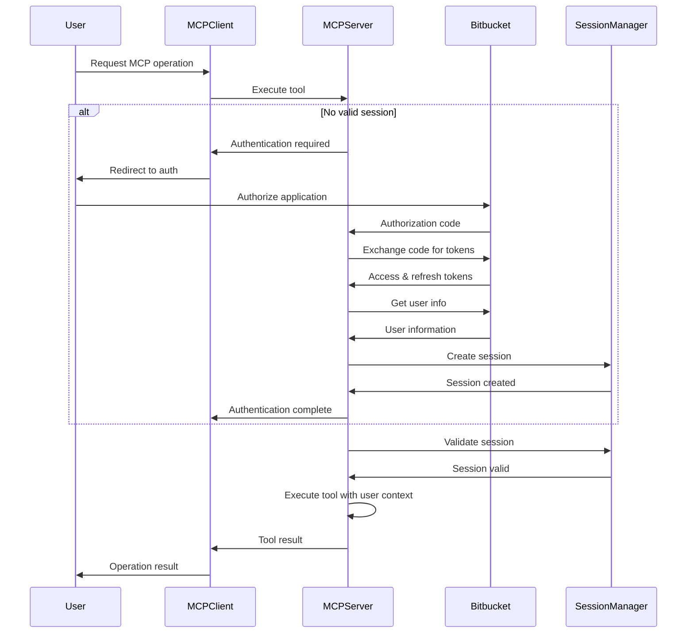
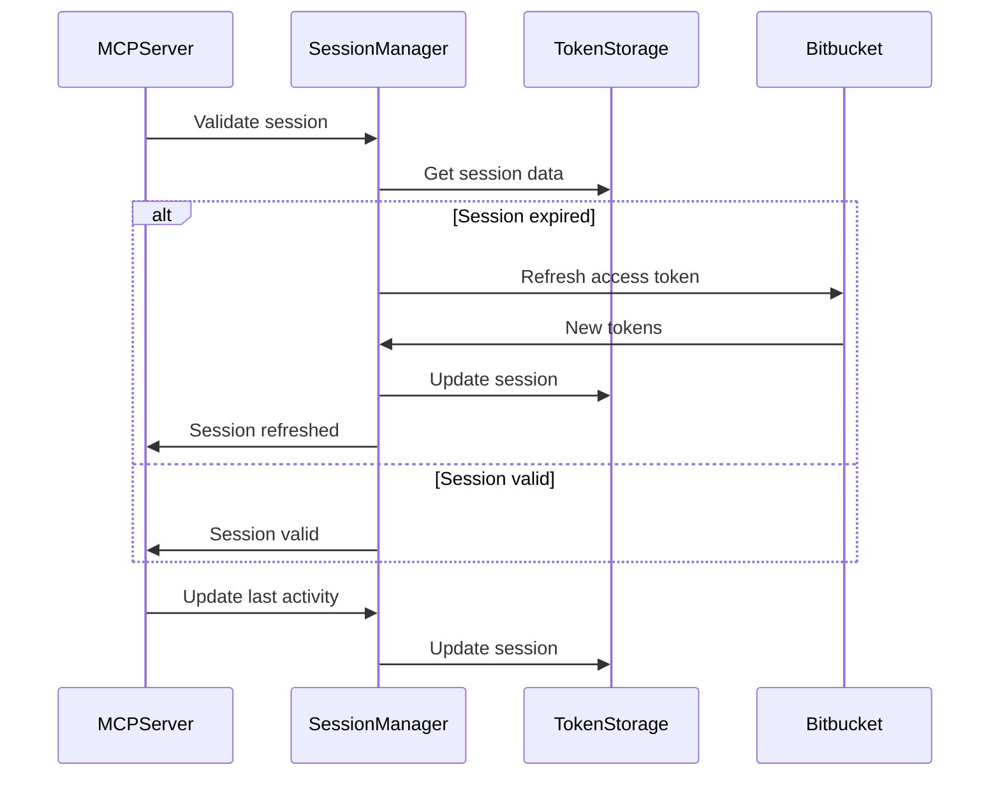
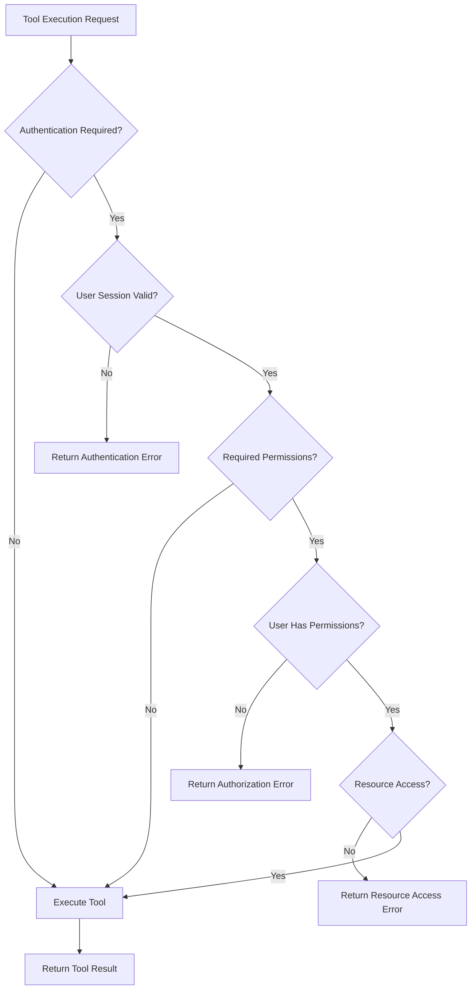

# Authentication and Authorization Flow

This document provides a comprehensive overview of the authentication and authorization flow in the Bitbucket MCP Server.

## Table of Contents

1. [Overview](#overview)
2. [OAuth 2.0 Flow](#oauth-20-flow)
3. [Session Management](#session-management)
4. [Permission System](#permission-system)
5. [MCP Integration](#mcp-integration)
6. [Flow Diagrams](#flow-diagrams)
7. [Implementation Details](#implementation-details)
8. [Security Considerations](#security-considerations)

## Overview

The Bitbucket MCP Server implements a comprehensive authentication and authorization system that:

- **Authenticates users** using OAuth 2.0 with Bitbucket
- **Manages user sessions** with secure token storage and refresh
- **Enforces permissions** based on user roles and Bitbucket access
- **Integrates seamlessly** with the MCP protocol
- **Supports both** Bitbucket Data Center and Cloud

### Key Components

1. **OAuth Manager**: Handles OAuth 2.0 authorization code flow
2. **Session Manager**: Manages user sessions and token lifecycle
3. **Authentication Middleware**: Validates requests and maintains context
4. **Permission System**: Enforces access control based on user permissions
5. **MCP Integration**: Provides authentication context to MCP tools

## OAuth 2.0 Flow

### 1. Authorization Request

When a user needs to authenticate, the server initiates the OAuth flow:

```typescript
// Generate authorization URL
const authUrl = await oauthManager.getAuthorizationUrl({
  clientId: process.env.OAUTH_CLIENT_ID,
  redirectUri: process.env.OAUTH_REDIRECT_URI,
  scope: ['repository:read', 'repository:write', 'pullrequest:read'],
  state: generateSecureState() // CSRF protection
});
```

**Authorization URL Structure:**
```
https://bitbucket-server.com/plugins/servlet/oauth/authorize?
  oauth_consumer_key=CLIENT_ID&
  oauth_callback=REDIRECT_URI&
  oauth_signature_method=HMAC-SHA1&
  oauth_timestamp=TIMESTAMP&
  oauth_nonce=NONCE&
  oauth_signature=SIGNATURE
```

### 2. User Authorization

The user is redirected to Bitbucket where they:

1. **Log in** to their Bitbucket account (if not already logged in)
2. **Review permissions** requested by the application
3. **Grant or deny** access to the requested scopes
4. **Complete authorization** by clicking "Allow" or "Deny"

### 3. Authorization Code Exchange

After user authorization, Bitbucket redirects back with an authorization code:

```typescript
// Handle callback with authorization code
const tokens = await oauthManager.exchangeCodeForTokens({
  code: authorizationCode,
  clientId: process.env.OAUTH_CLIENT_ID,
  clientSecret: process.env.OAUTH_CLIENT_SECRET,
  redirectUri: process.env.OAUTH_REDIRECT_URI
});
```

**Token Response:**
```json
{
  "access_token": "access_token_here",
  "refresh_token": "refresh_token_here",
  "token_type": "Bearer",
  "expires_in": 3600,
  "scope": "repository:read repository:write pullrequest:read"
}
```

### 4. User Information Retrieval

With the access token, the server retrieves user information:

```typescript
// Get user information from Bitbucket API
const userInfo = await bitbucketApi.getUserInfo(tokens.accessToken);
```

**User Information Response:**
```json
{
  "id": "user_id",
  "displayName": "John Doe",
  "emailAddress": "john.doe@company.com",
  "active": true,
  "permissions": [
    "REPO_READ",
    "REPO_WRITE",
    "PROJECT_READ",
    "PULL_REQUEST_READ"
  ]
}
```

## Session Management

### 1. Session Creation

A user session is created with the obtained information:

```typescript
// Create user session
const userSession = await sessionManager.createSession({
  userId: userInfo.id,
  userName: userInfo.displayName,
  userEmail: userInfo.emailAddress,
  accessToken: tokens.accessToken,
  refreshToken: tokens.refreshToken,
  permissions: userInfo.permissions,
  expiresAt: new Date(Date.now() + tokens.expires_in * 1000)
});
```

### 2. Session Storage

Sessions are stored securely with encryption:

```typescript
// Session storage structure
interface UserSession {
  id: string;                    // Unique session ID
  clientSessionId: string;       // MCP client session ID
  state: UserSessionState;       // Session state
  applicationId: string;         // OAuth application ID
  userId: string;                // Bitbucket user ID
  userName: string;              // User display name
  userEmail: string;             // User email
  accessToken: AccessToken;      // Encrypted access token
  refreshToken: RefreshToken;    // Encrypted refresh token
  createdAt: Date;               // Session creation time
  lastActivity: Date;            // Last activity timestamp
  expiresAt: Date;               // Session expiration time
  metadata: Record<string, any>; // Additional metadata
  permissions: string[];         // User permissions
}
```

### 3. Session Validation

Sessions are validated on each request:

```typescript
// Validate session
const isValid = await sessionManager.validateSession(sessionId);
if (!isValid) {
  // Redirect to authentication or return error
  throw new AuthenticationError('Session expired');
}
```

### 4. Token Refresh

Access tokens are automatically refreshed when needed:

```typescript
// Refresh access token
const newTokens = await oauthManager.refreshAccessToken({
  refreshToken: userSession.refreshToken,
  clientId: process.env.OAUTH_CLIENT_ID,
  clientSecret: process.env.OAUTH_CLIENT_SECRET
});

// Update session with new tokens
await sessionManager.updateSessionTokens(sessionId, newTokens);
```

## Permission System

### 1. Permission Types

The system supports various permission levels:

**Repository Permissions:**
- `REPO_READ`: Read repository information
- `REPO_WRITE`: Modify repository content
- `REPO_ADMIN`: Full repository administration

**Project Permissions:**
- `PROJECT_READ`: Read project information
- `PROJECT_WRITE`: Modify project settings
- `PROJECT_ADMIN`: Full project administration

**Pull Request Permissions:**
- `PULL_REQUEST_READ`: Read pull requests
- `PULL_REQUEST_WRITE`: Create and modify pull requests

**User Permissions:**
- `USER_READ`: Read user information
- `USER_WRITE`: Modify user settings

**Administrative Permissions:**
- `ADMIN_READ`: Read system information
- `ADMIN_WRITE`: Modify system settings

### 2. Permission Validation

Permissions are validated for each operation:

```typescript
// Check user permissions
function hasPermission(userPermissions: string[], requiredPermission: string): boolean {
  return userPermissions.includes(requiredPermission);
}

// Validate operation permissions
function validateOperationPermissions(
  operation: string,
  userPermissions: string[]
): void {
  const requiredPermissions = getRequiredPermissions(operation);
  
  for (const permission of requiredPermissions) {
    if (!hasPermission(userPermissions, permission)) {
      throw new AuthorizationError(`Missing required permission: ${permission}`);
    }
  }
}
```

### 3. Resource-Level Permissions

Permissions are also validated at the resource level:

```typescript
// Check repository access
async function checkRepositoryAccess(
  repositoryId: string,
  userPermissions: string[]
): Promise<boolean> {
  // Check if user has access to specific repository
  const repositoryPermissions = await getRepositoryPermissions(repositoryId);
  return repositoryPermissions.some(perm => userPermissions.includes(perm));
}
```

## MCP Integration

### 1. Authentication Context

MCP tools receive authentication context:

```typescript
// MCP tool execution with authentication
async function executeTool(
  toolName: string,
  params: any,
  userSession?: UserSession
): Promise<ToolExecutionResult> {
  // Validate authentication if required
  if (requiresAuthentication(toolName)) {
    if (!userSession) {
      throw new AuthenticationError('Authentication required');
    }
    
    if (!userSession.isActive()) {
      throw new AuthenticationError('Session expired');
    }
  }
  
  // Execute tool with user context
  return await tool.execute(params, userSession);
}
```

### 2. Tool-Specific Authentication

Different tools have different authentication requirements:

```typescript
// Tool authentication requirements
const toolAuthRequirements = {
  'search-ids': { required: false },
  'get-id': { required: false },
  'call-id': { required: true, minPermissionLevel: 'read' },
  'admin-tools': { required: true, minPermissionLevel: 'admin' }
};
```

### 3. Permission-Based Filtering

Tools filter results based on user permissions:

```typescript
// Filter results by user permissions
function filterResultsByPermissions(
  results: any[],
  userPermissions: string[]
): any[] {
  return results.filter(result => {
    const requiredPermissions = result.authentication?.permissions || [];
    return requiredPermissions.every(perm => userPermissions.includes(perm));
  });
}
```

## Flow Diagrams

### 1. Complete Authentication Flow



### 2. Session Management Flow



### 3. Permission Validation Flow



## Implementation Details

### 1. OAuth Manager Implementation

```typescript
export class OAuthManager {
  async getAuthorizationUrl(params: AuthorizationParams): Promise<string> {
    const state = generateSecureState();
    const timestamp = Math.floor(Date.now() / 1000);
    const nonce = generateNonce();
    
    const signature = this.generateSignature({
      method: 'GET',
      url: this.getAuthorizationEndpoint(),
      params: {
        oauth_consumer_key: params.clientId,
        oauth_callback: params.redirectUri,
        oauth_signature_method: 'HMAC-SHA1',
        oauth_timestamp: timestamp,
        oauth_nonce: nonce,
        oauth_signature: '' // Will be calculated
      }
    });
    
    return this.buildAuthorizationUrl({
      ...params,
      state,
      timestamp,
      nonce,
      signature
    });
  }
  
  async exchangeCodeForTokens(params: TokenExchangeParams): Promise<TokenResponse> {
    const response = await this.makeTokenRequest({
      grant_type: 'authorization_code',
      code: params.code,
      client_id: params.clientId,
      client_secret: params.clientSecret,
      redirect_uri: params.redirectUri
    });
    
    return this.parseTokenResponse(response);
  }
  
  async refreshAccessToken(params: RefreshTokenParams): Promise<TokenResponse> {
    const response = await this.makeTokenRequest({
      grant_type: 'refresh_token',
      refresh_token: params.refreshToken,
      client_id: params.clientId,
      client_secret: params.clientSecret
    });
    
    return this.parseTokenResponse(response);
  }
}
```

### 2. Session Manager Implementation

```typescript
export class SessionManager {
  async createSession(userData: UserSessionData): Promise<UserSession> {
    const sessionId = generateSessionId();
    const encryptedTokens = await this.encryptTokens({
      accessToken: userData.accessToken,
      refreshToken: userData.refreshToken
    });
    
    const session: UserSession = {
      id: sessionId,
      clientSessionId: userData.clientSessionId,
      state: 'active',
      applicationId: userData.applicationId,
      userId: userData.userId,
      userName: userData.userName,
      userEmail: userData.userEmail,
      accessToken: encryptedTokens.accessToken,
      refreshToken: encryptedTokens.refreshToken,
      createdAt: new Date(),
      lastActivity: new Date(),
      expiresAt: userData.expiresAt,
      metadata: userData.metadata || {},
      permissions: userData.permissions
    };
    
    await this.storage.saveSession(session);
    return session;
  }
  
  async validateSession(sessionId: string): Promise<boolean> {
    const session = await this.storage.getSession(sessionId);
    
    if (!session) {
      return false;
    }
    
    if (session.expiresAt < new Date()) {
      await this.storage.deleteSession(sessionId);
      return false;
    }
    
    // Update last activity
    session.lastActivity = new Date();
    await this.storage.updateSession(session);
    
    return true;
  }
  
  async refreshSessionTokens(sessionId: string): Promise<UserSession> {
    const session = await this.storage.getSession(sessionId);
    
    if (!session) {
      throw new AuthenticationError('Session not found');
    }
    
    const decryptedTokens = await this.decryptTokens({
      accessToken: session.accessToken,
      refreshToken: session.refreshToken
    });
    
    const newTokens = await this.oauthManager.refreshAccessToken({
      refreshToken: decryptedTokens.refreshToken,
      clientId: process.env.OAUTH_CLIENT_ID!,
      clientSecret: process.env.OAUTH_CLIENT_SECRET!
    });
    
    const encryptedNewTokens = await this.encryptTokens(newTokens);
    
    session.accessToken = encryptedNewTokens.accessToken;
    session.refreshToken = encryptedNewTokens.refreshToken;
    session.expiresAt = new Date(Date.now() + newTokens.expires_in * 1000);
    session.lastActivity = new Date();
    
    await this.storage.updateSession(session);
    return session;
  }
}
```

### 3. Authentication Middleware

```typescript
export class AuthenticationMiddleware {
  async authenticateRequest(request: MCPRequest): Promise<UserSession | null> {
    const sessionId = this.extractSessionId(request);
    
    if (!sessionId) {
      return null;
    }
    
    const session = await this.sessionManager.getSession(sessionId);
    
    if (!session || !session.isActive()) {
      return null;
    }
    
    // Update last activity
    await this.sessionManager.updateLastActivity(sessionId);
    
    return session;
  }
  
  async authorizeOperation(
    operation: string,
    userSession: UserSession
  ): Promise<void> {
    const requiredPermissions = this.getRequiredPermissions(operation);
    
    if (requiredPermissions.length === 0) {
      return; // No permissions required
    }
    
    const userPermissions = userSession.permissions;
    const hasAllPermissions = requiredPermissions.every(permission =>
      userPermissions.includes(permission)
    );
    
    if (!hasAllPermissions) {
      throw new AuthorizationError(
        `Missing required permissions: ${requiredPermissions.join(', ')}`
      );
    }
  }
  
  private extractSessionId(request: MCPRequest): string | null {
    // Extract session ID from request headers or cookies
    return request.headers['x-session-id'] || 
           request.cookies?.sessionId || 
           null;
  }
}
```

## Security Considerations

### 1. Token Security

- **Encryption**: All tokens are encrypted at rest using AES-256
- **Transmission**: Tokens are transmitted over HTTPS only
- **Storage**: Tokens are stored securely with proper access controls
- **Rotation**: Access tokens are refreshed automatically
- **Revocation**: Tokens can be revoked when sessions end

### 2. Session Security

- **Secure Cookies**: Session cookies use secure, httpOnly, and sameSite flags
- **Session Timeout**: Sessions expire after configurable time periods
- **Concurrent Sessions**: Support for multiple concurrent sessions per user
- **Session Monitoring**: Track session activity for security monitoring

### 3. CSRF Protection

- **State Parameter**: OAuth flow includes state parameter for CSRF protection
- **Nonce Validation**: Each request includes nonce validation
- **Origin Validation**: Validate request origins to prevent CSRF attacks

### 4. Rate Limiting

- **Request Limiting**: Implement rate limiting on authentication endpoints
- **IP-based Limiting**: Rate limit based on IP addresses
- **User-based Limiting**: Rate limit based on user accounts
- **Progressive Delays**: Implement progressive delays for repeated violations

### 5. Audit Logging

- **Authentication Events**: Log all authentication attempts (success and failure)
- **Permission Changes**: Log changes to user permissions
- **Session Events**: Log session creation, validation, and termination
- **Security Events**: Log suspicious activities and security violations

## Next Steps

After understanding the authentication flow:

1. **Implement the OAuth flow** in your application
2. **Configure session management** according to your security requirements
3. **Set up permission validation** for your specific use cases
4. **Implement monitoring and logging** for security events
5. **Test the complete flow** with your Bitbucket instance

For additional help:
- [Authentication Setup Guide](./authentication-setup.md)
- [OAuth Registration Guide](./oauth-registration-guide.md)
- [Environment Configuration Guide](./environment-configuration.md)
- [Troubleshooting Guide](./troubleshooting.md)
