# Data Model: Inicio do Projeto

**Feature**: Inicio do Projeto  
**Date**: 2025-01-27  
**Status**: Complete

## Entity Overview

Este documento define as entidades principais para inicialização do projeto Bitbucket MCP Server, baseadas nos requisitos funcionais e na Constituição.

## Core Entities

### 1. Project
**Purpose**: Representa a estrutura base do servidor MCP Bitbucket com configurações e dependências conforme Constituição.

```typescript
interface Project {
  name: string;                    // Nome do projeto
  version: string;                 // Versão semântica (MAJOR.MINOR.PATCH)
  description: string;             // Descrição do projeto
  license: string;                 // Licença (LGPL-3.0)
  repository: string;              // URL do repositório
  homepage: string;                // URL da homepage
  keywords: string[];              // Palavras-chave para NPM
  author: Author;                  // Informações do autor
  engines: EngineRequirements;    // Requisitos de runtime
  dependencies: Dependencies;      // Dependências de produção
  devDependencies: Dependencies;   // Dependências de desenvolvimento
  scripts: Scripts;               // Scripts NPM
  config: ProjectConfig;          // Configurações do projeto
}
```

**Validation Rules**:
- Nome deve seguir convenções NPM (lowercase, sem espaços)
- Versão deve seguir versionamento semântico
- Licença deve ser LGPL-3.0 conforme Constituição
- Engines devem especificar Node.js >= 18.0.0

### 2. Configuration
**Purpose**: Define parâmetros de build, teste, desenvolvimento, transporte e autenticação do projeto.

```typescript
interface Configuration {
  server: ServerConfig;           // Configurações do servidor MCP
  client: ClientConfig;           // Configurações do cliente CLI
  authentication: AuthConfig;     // Configurações de autenticação
  transport: TransportConfig;     // Configurações de transporte
  cache: CacheConfig;            // Configurações de cache
  logging: LoggingConfig;        // Configurações de logging
  security: SecurityConfig;      // Configurações de segurança
  performance: PerformanceConfig; // Configurações de performance
  testing: TestingConfig;        // Configurações de testes
  development: DevelopmentConfig; // Configurações de desenvolvimento
}
```

**Validation Rules**:
- Todas as configurações devem ter valores padrão sensatos
- Configurações sensíveis devem ser validadas via Zod schemas
- Configurações de produção devem forçar HTTPS

### 3. Dependency
**Purpose**: Representa pacotes NPM oficiais necessários (MCP SDK, TypeScript, Zod, Winston, etc.).

```typescript
interface Dependency {
  name: string;                   // Nome do pacote
  version: string;                // Versão específica ou range
  type: 'production' | 'development'; // Tipo da dependência
  category: DependencyCategory;   // Categoria da dependência
  purpose: string;                // Propósito da dependência
  official: boolean;              // Se é pacote oficial
  constitutionCompliant: boolean; // Se atende requisitos constitucionais
}
```

**Validation Rules**:
- Versões devem ser específicas para dependências críticas
- Dependências oficiais devem ser priorizadas
- Todas as dependências devem ser constitution-compliant

### 4. Transport
**Purpose**: Configuração de protocolos MCP (stdio, HTTP, SSE, HTTP streaming) para comunicação.

```typescript
interface Transport {
  type: TransportType;            // Tipo do transporte
  enabled: boolean;               // Se está habilitado
  config: TransportSpecificConfig; // Configurações específicas
  fallback: TransportType[];      // Transportes de fallback
  priority: number;               // Prioridade (menor = maior prioridade)
}
```

**Validation Rules**:
- Pelo menos um transporte deve estar habilitado
- Fallback deve ser configurado para todos os transportes
- Prioridades devem ser únicas

### 5. Authentication
**Purpose**: Configuração de métodos de autenticação com prioridade definida (OAuth 2.0, tokens, etc.).

```typescript
interface Authentication {
  methods: AuthMethod[];          // Métodos de autenticação
  priority: AuthMethod[];         // Ordem de prioridade
  fallback: AuthMethod;           // Método de fallback
  config: AuthMethodConfig;       // Configurações específicas
}
```

**Validation Rules**:
- OAuth 2.0 deve ter prioridade máxima
- Pelo menos um método deve estar configurado
- Fallback deve ser configurado

### 6. Cache
**Purpose**: Configuração de cache com TTL, tamanho máximo e suporte Redis opcional.

```typescript
interface Cache {
  enabled: boolean;               // Se cache está habilitado
  type: 'memory' | 'redis';      // Tipo de cache
  ttl: number;                   // Time to live em segundos
  maxSize: string;               // Tamanho máximo (ex: "100MB")
  redis?: RedisConfig;           // Configurações Redis (opcional)
  partitioning: CachePartitioning; // Configurações de particionamento
}
```

**Validation Rules**:
- TTL deve ser >= 60 segundos
- MaxSize deve ser um valor válido (ex: "100MB")
- Redis deve ser opcional

### 7. Logging
**Purpose**: Configuração de logs estruturados com sanitização de dados sensíveis.

```typescript
interface Logging {
  level: LogLevel;                // Nível de log
  format: 'json' | 'pretty';      // Formato de saída
  destinations: LogDestination[]; // Destinos de log
  sanitization: SanitizationConfig; // Configurações de sanitização
  rotation: RotationConfig;       // Configurações de rotação
  correlation: CorrelationConfig; // Configurações de correlação
}
```

**Validation Rules**:
- Nível deve ser válido (error, warn, info, debug)
- Sanitização deve estar habilitada em produção
- Rotação deve ser configurada

### 8. Testing
**Purpose**: Estrutura TDD com cobertura obrigatória >80% (contract, integration, unit).

```typescript
interface Testing {
  framework: 'jest';              // Framework de testes
  coverage: CoverageConfig;       // Configurações de cobertura
  structure: TestStructure;       // Estrutura de testes
  tdd: TDDConfig;                // Configurações TDD
  gates: TestGates;              // Gates de aprovação
}
```

**Validation Rules**:
- Cobertura deve ser >= 80%
- TDD deve ser obrigatório
- Gates de aprovação devem estar configurados

## Supporting Types

### Author
```typescript
interface Author {
  name: string;
  email: string;
  url?: string;
}
```

### EngineRequirements
```typescript
interface EngineRequirements {
  node: string;                   // ">=18.0.0"
  npm?: string;                   // Versão NPM (opcional)
}
```

### Scripts
```typescript
interface Scripts {
  build: string;                  // "tsc"
  dev: string;                    // "tsx watch src/server/index.ts"
  start: string;                  // "node dist/server/index.js"
  cli: string;                    // "node dist/client/cli/index.js"
  test: string;                   // "jest"
  'test:unit': string;            // "jest tests/unit"
  'test:integration': string;     // "jest tests/integration"
  'test:contract': string;        // "jest tests/contract"
  'test:coverage': string;        // "jest --coverage"
  lint: string;                   // "eslint src/**/*.ts"
  'lint:fix': string;            // "eslint src/**/*.ts --fix"
  format: string;                 // "prettier --write src/**/*.ts"
  clean: string;                  // "rimraf dist"
  publish: string;                // "npm publish"
}
```

### ServerConfig
```typescript
interface ServerConfig {
  port: number;                   // Porta do servidor
  host: string;                   // Host do servidor
  protocol: 'http' | 'https';     // Protocolo
  path: string;                   // Caminho base
  timeout: number;                // Timeout em ms
}
```

### ClientConfig
```typescript
interface ClientConfig {
  name: string;                   // Nome do CLI
  version: string;                // Versão do CLI
  description: string;            // Descrição do CLI
  commands: CommandConfig[];      // Configurações de comandos
}
```

### AuthConfig
```typescript
interface AuthConfig {
  oauth2?: OAuth2Config;          // Configurações OAuth 2.0
  personalToken?: PersonalTokenConfig; // Configurações Personal Token
  appPassword?: AppPasswordConfig; // Configurações App Password
  basic?: BasicAuthConfig;        // Configurações Basic Auth
}
```

### TransportConfig
```typescript
interface TransportConfig {
  stdio: StdioConfig;             // Configurações stdio
  http: HttpConfig;               // Configurações HTTP
  sse: SSEConfig;                 // Configurações SSE
  streaming: StreamingConfig;     // Configurações HTTP streaming
}
```

### SecurityConfig
```typescript
interface SecurityConfig {
  helmet: HelmetConfig;           // Configurações Helmet
  cors: CorsConfig;               // Configurações CORS
  rateLimit: RateLimitConfig;     // Configurações rate limiting
  circuitBreaker: CircuitBreakerConfig; // Configurações circuit breaker
  ssl: SSLConfig;                 // Configurações SSL/TLS
}
```

### PerformanceConfig
```typescript
interface PerformanceConfig {
  responseTime: number;           // Tempo de resposta alvo (ms)
  uptime: number;                 // Uptime alvo (%)
  memoryLimit: string;            // Limite de memória
  cpuLimit: string;               // Limite de CPU
}
```

### TestingConfig
```typescript
interface TestingConfig {
  framework: string;              // "jest"
  coverage: number;               // 80
  timeout: number;                // Timeout dos testes (ms)
  environment: string;            // Ambiente de teste
  mockResponses: boolean;         // Se deve usar mocks
}
```

### DevelopmentConfig
```typescript
interface DevelopmentConfig {
  nodeEnv: string;                // "development"
  debug: boolean;                 // Se debug está habilitado
  hotReload: boolean;             // Se hot reload está habilitado
  sourceMaps: boolean;            // Se source maps estão habilitados
}
```

## Entity Relationships

```mermaid
graph TD
    A[Project] --> B[Configuration]
    A --> C[Dependencies]
    A --> D[Scripts]
    
    B --> E[ServerConfig]
    B --> F[ClientConfig]
    B --> G[AuthConfig]
    B --> H[TransportConfig]
    B --> I[CacheConfig]
    B --> J[LoggingConfig]
    B --> K[SecurityConfig]
    B --> L[PerformanceConfig]
    B --> M[TestingConfig]
    B --> N[DevelopmentConfig]
    
    G --> O[OAuth2Config]
    G --> P[PersonalTokenConfig]
    G --> Q[AppPasswordConfig]
    G --> R[BasicAuthConfig]
    
    H --> S[StdioConfig]
    H --> T[HttpConfig]
    H --> U[SSEConfig]
    H --> V[StreamingConfig]
    
    I --> W[RedisConfig]
    I --> X[CachePartitioning]
    
    J --> Y[SanitizationConfig]
    J --> Z[RotationConfig]
    J --> AA[CorrelationConfig]
    
    K --> BB[HelmetConfig]
    K --> CC[CorsConfig]
    K --> DD[RateLimitConfig]
    K --> EE[CircuitBreakerConfig]
    K --> FF[SSLConfig]
    
    M --> GG[CoverageConfig]
    M --> HH[TestStructure]
    M --> II[TDDConfig]
    M --> JJ[TestGates]
```



## State Transitions

### Project Lifecycle
```
INITIAL → CONFIGURED → BUILT → TESTED → DEPLOYED
```

### Configuration Validation
```
INVALID → VALIDATING → VALID → APPLIED
```

### Authentication Flow
```
UNAUTHENTICATED → AUTHENTICATING → AUTHENTICATED → EXPIRED → REAUTHENTICATING
```

### Transport Status
```
DISABLED → ENABLING → ENABLED → FAILED → FALLBACK
```

## Validation Schemas

### Project Schema (Zod)
```typescript
const ProjectSchema = z.object({
  name: z.string().min(1).max(214).regex(/^[a-z0-9-]+$/),
  version: z.string().regex(/^\d+\.\d+\.\d+$/),
  description: z.string().min(1).max(1000),
  license: z.literal('LGPL-3.0'),
  repository: z.string().url(),
  homepage: z.string().url(),
  keywords: z.array(z.string()).min(1),
  author: AuthorSchema,
  engines: EngineRequirementsSchema,
  dependencies: DependenciesSchema,
  devDependencies: DependenciesSchema,
  scripts: ScriptsSchema,
  config: ProjectConfigSchema
});
```

### Configuration Schema (Zod)
```typescript
const ConfigurationSchema = z.object({
  server: ServerConfigSchema,
  client: ClientConfigSchema,
  authentication: AuthConfigSchema,
  transport: TransportConfigSchema,
  cache: CacheConfigSchema,
  logging: LoggingConfigSchema,
  security: SecurityConfigSchema,
  performance: PerformanceConfigSchema,
  testing: TestingConfigSchema,
  development: DevelopmentConfigSchema
});
```

## Data Flow

### Project Initialization
1. **Input**: User description "Inicio do projeto"
2. **Process**: Generate Project entity with default Configuration
3. **Validate**: Ensure Constitution compliance
4. **Output**: Complete project structure with all entities

### Configuration Application
1. **Input**: Configuration entity
2. **Process**: Validate against Zod schemas
3. **Apply**: Set environment variables and runtime config
4. **Output**: Applied configuration with validation results

### Dependency Resolution
1. **Input**: Dependency entities
2. **Process**: Resolve versions and check compatibility
3. **Install**: Install via npm/yarn/pnpm
4. **Output**: Installed dependencies with version lock

## Error Handling

### Validation Errors
- **Field-level**: Specific field validation failures
- **Schema-level**: Cross-field validation failures
- **Constitution-level**: Constitutional compliance failures

### Configuration Errors
- **Missing**: Required configuration not provided
- **Invalid**: Configuration values don't meet requirements
- **Conflicting**: Multiple configurations conflict

### Dependency Errors
- **Version**: Version conflicts or incompatibilities
- **Installation**: Package installation failures
- **Compatibility**: Constitution compliance failures

---

**Data Model Status**: ✅ COMPLETE  
**All Entities Defined**: ✅ YES  
**Validation Schemas**: ✅ COMPLETE  
**Relationships Mapped**: ✅ YES  
**Ready for Contracts**: ✅ YES
