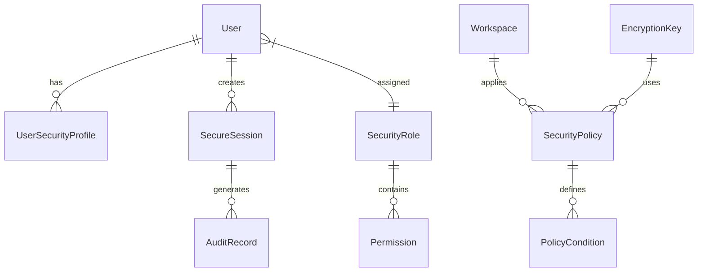

# Advanced Security Data Model

## Security Entities

### User Security Profile
```typescript
interface UserSecurityProfile {
  userId: string;
  mfaEnabled: boolean;
  mfaProviders: MFAProvider[];
  backupCodes: string[];
  lastPasswordChange: Date;
  failedLoginAttempts: number;
  accountLocked: boolean;
  lockoutExpires?: Date;
  trustedDevices: TrustedDevice[];
  securityQuestions?: SecurityQuestion[];
}
```

### Session Security Context
```typescript
interface SecureSession {
  sessionId: string;
  userId: string;
  workspaceId?: string;
  createdAt: Date;
  lastActivity: Date;
  expiresAt: Date;
  ipAddress: string;
  userAgent: string;
  deviceFingerprint: string;
  mfaVerified: boolean;
  permissions: Permission[];
  securityLevel: 'basic' | 'elevated' | 'admin';
  flags: SessionFlag[];
}
```

### Audit Trail
```typescript
interface AuditRecord {
  id: string;
  timestamp: Date;
  eventType: SecurityEventType;
  severity: 'low' | 'medium' | 'high' | 'critical';
  userId?: string;
  workspaceId?: string;
  resourceType: string;
  resourceId?: string;
  action: string;
  result: 'success' | 'failure' | 'error';
  ipAddress: string;
  userAgent: string;
  details: AuditDetails;
  correlationId?: string;
}
```

### Role-Based Access Control
```typescript
interface SecurityRole {
  id: string;
  name: string;
  description: string;
  level: number;
  permissions: Permission[];
  inheritsFrom: string[];
  workspaceScoped: boolean;
  conditions: AccessCondition[];
}

interface Permission {
  id: string;
  resource: string;
  action: string;
  effect: 'allow' | 'deny';
  conditions?: PolicyCondition[];
  priority: number;
}
```

### Security Policies
```typescript
interface SecurityPolicy {
  id: string;
  name: string;
  type: 'authentication' | 'authorization' | 'encryption' | 'audit';
  enabled: boolean;
  configuration: PolicyConfiguration;
  applicableRoles: string[];
  workspaces: string[];
  conditions: PolicyCondition[];
  createdAt: Date;
  modifiedAt: Date;
}
```

### Encryption Keys
```typescript
interface EncryptionKey {
  id: string;
  type: 'aes-256' | 'rsa-2048' | 'ecdsa-p256';
  usage: 'data' | 'transport' | 'signing';
  keyData: string; // encrypted
  createdAt: Date;
  expiresAt?: Date;
  rotatedAt?: Date;
  status: 'active' | 'deprecated' | 'revoked';
  workspaceId?: string;
}
```

## Security Events

### Event Types
```typescript
enum SecurityEventType {
  // Authentication Events
  LOGIN_SUCCESS = 'auth.login.success',
  LOGIN_FAILURE = 'auth.login.failure',
  LOGOUT = 'auth.logout',
  MFA_CHALLENGE = 'auth.mfa.challenge',
  MFA_SUCCESS = 'auth.mfa.success',
  MFA_FAILURE = 'auth.mfa.failure',
  
  // Authorization Events
  ACCESS_GRANTED = 'authz.access.granted',
  ACCESS_DENIED = 'authz.access.denied',
  PERMISSION_CHANGED = 'authz.permission.changed',
  ROLE_ASSIGNED = 'authz.role.assigned',
  
  // Security Events
  ACCOUNT_LOCKED = 'security.account.locked',
  SUSPICIOUS_ACTIVITY = 'security.activity.suspicious',
  SECURITY_VIOLATION = 'security.violation',
  DATA_BREACH_ATTEMPT = 'security.breach.attempt',
  
  // Administrative Events
  SECURITY_CONFIG_CHANGED = 'admin.security.config.changed',
  KEY_ROTATED = 'admin.key.rotated',
  AUDIT_LOG_ACCESSED = 'admin.audit.accessed'
}
```

## Data Relationships



## Storage Requirements

### High-Frequency Data (Redis/Cache)
- Active sessions
- Rate limiting counters  
- MFA verification states
- Security alerts queue

### Persistent Data (Database)
- User security profiles
- Audit records
- Security policies
- Encryption keys (encrypted)
- Role definitions

### Archival Data (Cold Storage)
- Historical audit logs (>90 days)
- Deprecated encryption keys
- Compliance reports
- Security incident records

## Data Retention Policies

| Data Type | Retention Period | Archive After | Delete After |
|-----------|------------------|---------------|--------------|
| Audit Logs | 7 years | 1 year | Never (compliance) |
| Session Data | 30 days | N/A | 30 days |
| Security Events | 2 years | 90 days | 2 years |
| MFA Codes | 24 hours | N/A | 24 hours |
| Rate Limit Data | 1 hour | N/A | 1 hour |
| Encryption Keys | Indefinite | Never | Manual only |

## Security Classifications

### Data Sensitivity Levels
1. **Public**: Non-sensitive operational data
2. **Internal**: Business operational data
3. **Confidential**: User data, tokens, configurations
4. **Restricted**: Encryption keys, security policies, audit logs
5. **Top Secret**: Master keys, security incidents, breach data

### Access Control Matrix
| Role | Public | Internal | Confidential | Restricted | Top Secret |
|------|--------|----------|--------------|------------|------------|
| User | Read | - | Own Data | - | - |
| Admin | Read/Write | Read/Write | Read | Read | - |
| Security Admin | Read/Write | Read/Write | Read/Write | Read/Write | Read |
| System | Read/Write | Read/Write | Read/Write | Read/Write | Read/Write |