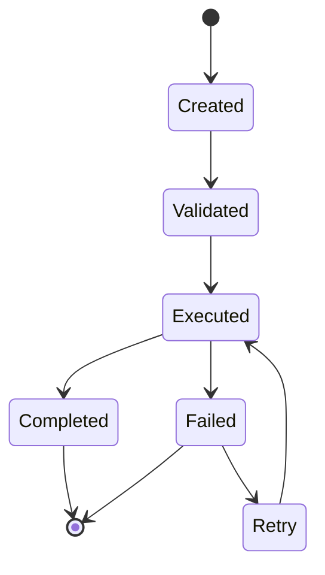
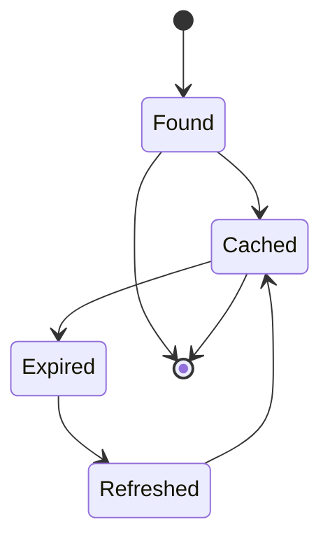

# Data Model: Sistema de Busca

**Feature**: Sistema de Busca  
**Date**: 2024-12-19  
**Status**: Complete

## Entity Definitions

### SearchQuery
Representa uma consulta de busca com filtros e parâmetros de paginação.

```typescript
interface SearchQuery {
  query: string;                    // Termo de busca principal
  filters: SearchFilters;          // Filtros aplicados
  sortBy: string;                  // Campo para ordenação
  sortOrder: 'asc' | 'desc';      // Direção da ordenação
  page: number;                    // Página atual (baseado em 0)
  limit: number;                   // Resultados por página (max 1000)
}
```

**Validation Rules**:
- `query`: Obrigatório, não vazio, máximo 500 caracteres
- `filters`: Opcional, objeto válido
- `sortBy`: Opcional, valores permitidos dependem do tipo de busca
- `sortOrder`: Opcional, padrão 'desc'
- `page`: Opcional, padrão 0, mínimo 0
- `limit`: Opcional, padrão 25, mínimo 1, máximo 1000

### SearchFilters
Filtros específicos para cada tipo de busca.

```typescript
interface SearchFilters {
  // Filtros comuns
  projectKey?: string;             // Filtro por projeto (Data Center)
  workspace?: string;              // Filtro por workspace (Cloud)
  repositorySlug?: string;         // Filtro por repositório
  
  // Filtros de data
  fromDate?: string;               // Data início (ISO 8601)
  toDate?: string;                 // Data fim (ISO 8601)
  
  // Filtros específicos para commits
  author?: string;                 // Autor do commit
  committer?: string;              // Committer do commit
  
  // Filtros específicos para pull requests
  state?: 'OPEN' | 'MERGED' | 'DECLINED' | 'SUPERSEDED'; // Estado do PR
  reviewer?: string;               // Revisor do PR
  
  // Filtros específicos para código
  fileExtension?: string;          // Extensão do arquivo
  language?: string;               // Linguagem de programação
}
```

**Validation Rules**:
- `projectKey`: Opcional, formato válido de chave de projeto
- `workspace`: Opcional, formato válido de workspace
- `repositorySlug`: Opcional, formato válido de slug
- `fromDate`/`toDate`: Opcional, formato ISO 8601 válido
- `author`/`committer`: Opcional, formato válido de usuário
- `state`: Opcional, valores permitidos
- `reviewer`: Opcional, formato válido de usuário
- `fileExtension`: Opcional, extensão válida (ex: .js, .ts)
- `language`: Opcional, linguagem válida (ex: javascript, typescript)

### SearchResult
Representa um resultado de busca individual.

```typescript
interface SearchResult {
  type: SearchResultType;          // Tipo do resultado
  id: string;                      // Identificador único
  title: string;                   // Título ou nome
  description: string;             // Descrição ou resumo
  url: string;                     // URL para acessar o item
  metadata: SearchResultMetadata;  // Dados específicos do tipo
  relevanceScore: number;          // Pontuação de relevância (0-1)
}
```

**Validation Rules**:
- `type`: Obrigatório, valor válido
- `id`: Obrigatório, não vazio
- `title`: Obrigatório, não vazio, máximo 200 caracteres
- `description`: Opcional, máximo 500 caracteres
- `url`: Obrigatório, URL válida
- `metadata`: Obrigatório, objeto válido
- `relevanceScore`: Obrigatório, número entre 0 e 1

### SearchResultType
Tipos de resultados de busca suportados.

```typescript
type SearchResultType = 
  | 'repository'
  | 'commit' 
  | 'pullrequest'
  | 'code'
  | 'user';
```

### SearchResultMetadata
Metadados específicos para cada tipo de resultado.

```typescript
interface SearchResultMetadata {
  // Metadados comuns
  projectKey?: string;             // Projeto (Data Center)
  workspace?: string;              // Workspace (Cloud)
  repositorySlug?: string;         // Repositório
  lastModified?: string;           // Última modificação (ISO 8601)
  
  // Metadados específicos para repositórios
  isPublic?: boolean;              // Se é público
  language?: string;               // Linguagem principal
  size?: number;                   // Tamanho em bytes
  
  // Metadados específicos para commits
  author?: string;                 // Autor do commit
  committer?: string;              // Committer do commit
  commitDate?: string;             // Data do commit (ISO 8601)
  message?: string;                // Mensagem do commit
  
  // Metadados específicos para pull requests
  state?: string;                  // Estado do PR
  author?: string;                 // Autor do PR
  createdDate?: string;            // Data de criação (ISO 8601)
  updatedDate?: string;            // Data de atualização (ISO 8601)
  reviewers?: string[];            // Lista de revisores
  
  // Metadados específicos para código
  filePath?: string;               // Caminho do arquivo
  lineNumber?: number;             // Número da linha
  context?: string;                // Contexto do código
  language?: string;               // Linguagem do arquivo
  
  // Metadados específicos para usuários
  displayName?: string;            // Nome de exibição
  emailAddress?: string;           // Endereço de email
  active?: boolean;                // Se está ativo
}
```

### SearchHistory
Histórico de buscas do usuário.

```typescript
interface SearchHistory {
  userId: string;                  // ID do usuário
  query: string;                   // Query executada
  timestamp: string;               // Quando foi executada (ISO 8601)
  resultCount: number;             // Quantidade de resultados
  filters: SearchFilters;          // Filtros utilizados
  searchType: SearchResultType;    // Tipo de busca executada
}
```

**Validation Rules**:
- `userId`: Obrigatório, formato válido de usuário
- `query`: Obrigatório, não vazio
- `timestamp`: Obrigatório, formato ISO 8601 válido
- `resultCount`: Obrigatório, número >= 0
- `filters`: Obrigatório, objeto válido
- `searchType`: Obrigatório, valor válido

### SearchResponse
Resposta paginada de uma busca.

```typescript
interface SearchResponse {
  results: SearchResult[];         // Lista de resultados
  pagination: SearchPagination;    // Informações de paginação
  totalCount: number;              // Total de resultados
  searchTime: number;              // Tempo de busca em ms
  suggestions?: string[];          // Sugestões de busca
}
```

**Validation Rules**:
- `results`: Obrigatório, array válido
- `pagination`: Obrigatório, objeto válido
- `totalCount`: Obrigatório, número >= 0
- `searchTime`: Obrigatório, número >= 0
- `suggestions`: Opcional, array de strings

### SearchPagination
Informações de paginação.

```typescript
interface SearchPagination {
  page: number;                    // Página atual
  limit: number;                   // Resultados por página
  totalPages: number;              // Total de páginas
  hasNext: boolean;                // Se tem próxima página
  hasPrevious: boolean;            // Se tem página anterior
  nextPage?: number;               // Número da próxima página
  previousPage?: number;           // Número da página anterior
}
```

**Validation Rules**:
- `page`: Obrigatório, número >= 0
- `limit`: Obrigatório, número > 0
- `totalPages`: Obrigatório, número >= 0
- `hasNext`: Obrigatório, boolean
- `hasPrevious`: Obrigatório, boolean
- `nextPage`: Opcional, número > page
- `previousPage`: Opcional, número < page

## State Transitions

### SearchQuery States


### SearchResult States


## Relationships

### Entity Relationships
- `SearchQuery` → `SearchFilters` (1:1)
- `SearchQuery` → `SearchResponse` (1:1)
- `SearchResponse` → `SearchResult[]` (1:N)
- `SearchResponse` → `SearchPagination` (1:1)
- `SearchResult` → `SearchResultMetadata` (1:1)
- `SearchHistory` → `SearchFilters` (1:1)

### API Relationships
- `SearchQuery` → Bitbucket Search API (1:1)
- `SearchResult` → Bitbucket Resource (1:1)
- `SearchHistory` → User Session (N:1)

## Validation Schemas (Zod)

```typescript
import { z } from 'zod';

const SearchQuerySchema = z.object({
  query: z.string().min(1).max(500),
  filters: z.object({
    projectKey: z.string().optional(),
    workspace: z.string().optional(),
    repositorySlug: z.string().optional(),
    fromDate: z.string().datetime().optional(),
    toDate: z.string().datetime().optional(),
    author: z.string().optional(),
    committer: z.string().optional(),
    state: z.enum(['OPEN', 'MERGED', 'DECLINED', 'SUPERSEDED']).optional(),
    reviewer: z.string().optional(),
    fileExtension: z.string().optional(),
    language: z.string().optional(),
  }).optional(),
  sortBy: z.string().optional(),
  sortOrder: z.enum(['asc', 'desc']).default('desc'),
  page: z.number().int().min(0).default(0),
  limit: z.number().int().min(1).max(1000).default(25),
});

const SearchResultSchema = z.object({
  type: z.enum(['repository', 'commit', 'pullrequest', 'code', 'user']),
  id: z.string().min(1),
  title: z.string().min(1).max(200),
  description: z.string().max(500).optional(),
  url: z.string().url(),
  metadata: z.object({
    projectKey: z.string().optional(),
    workspace: z.string().optional(),
    repositorySlug: z.string().optional(),
    lastModified: z.string().datetime().optional(),
    isPublic: z.boolean().optional(),
    language: z.string().optional(),
    size: z.number().int().min(0).optional(),
    author: z.string().optional(),
    committer: z.string().optional(),
    commitDate: z.string().datetime().optional(),
    message: z.string().optional(),
    state: z.string().optional(),
    createdDate: z.string().datetime().optional(),
    updatedDate: z.string().datetime().optional(),
    reviewers: z.array(z.string()).optional(),
    filePath: z.string().optional(),
    lineNumber: z.number().int().min(1).optional(),
    context: z.string().optional(),
    displayName: z.string().optional(),
    emailAddress: z.string().email().optional(),
    active: z.boolean().optional(),
  }),
  relevanceScore: z.number().min(0).max(1),
});

const SearchResponseSchema = z.object({
  results: z.array(SearchResultSchema),
  pagination: z.object({
    page: z.number().int().min(0),
    limit: z.number().int().min(1),
    totalPages: z.number().int().min(0),
    hasNext: z.boolean(),
    hasPrevious: z.boolean(),
    nextPage: z.number().int().optional(),
    previousPage: z.number().int().optional(),
  }),
  totalCount: z.number().int().min(0),
  searchTime: z.number().min(0),
  suggestions: z.array(z.string()).optional(),
});

const SearchHistorySchema = z.object({
  userId: z.string().min(1),
  query: z.string().min(1),
  timestamp: z.string().datetime(),
  resultCount: z.number().int().min(0),
  filters: z.object({}).passthrough(), // SearchFilters object
  searchType: z.enum(['repository', 'commit', 'pullrequest', 'code', 'user']),
});
```

## Data Model Complete

O modelo de dados está completo e alinhado com:
- ✅ Especificação da feature (entidades SearchQuery, SearchResult, SearchHistory)
- ✅ Requisitos funcionais (filtros, paginação, ordenação)
- ✅ Requisitos não-funcionais (validação, performance)
- ✅ Princípios constitucionais (simplicidade, validação com Zod)
- ✅ Padrões MCP (schemas para ferramentas MCP)

**Próximos passos**: Gerar contratos de API baseados neste modelo de dados.
